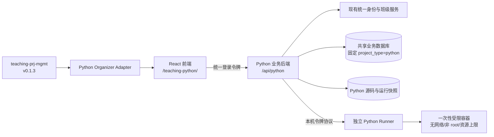

# Python 编程教学工具建设方案

## 1. 文档用途

本文用于指导新建第三个青少年编程教学工具 `teaching-python`。目标是形成三套定位清晰、体验一致、数据隔离的教学产品：

| 工具 | 主要教学方向 | 典型学习内容 |
| --- | --- | --- |
| p5.js | 创意编程与即时图形反馈 | 坐标、动画、交互、视觉作品 |
| C++ | 算法、编译与严谨程序结构 | 输入输出、分支、循环、函数、算法 |
| Python | 入门语法、数据处理与通用编程 | 字符串、列表、字典、函数、类、文本处理 |

Python 工具应沿用 p5.js 和 C++ 已验证的产品结构、作品管理方式、班级权限和中英文切换体验，不另行创造一套不一致的交互。

本文是实施方案，不代表已经创建代码、数据库、生产目录或部署脚本。首阶段只完成本地开发和验证；未获得明确授权前，不连接或修改生产服务器。

## 2. 推荐结论

建议新建独立仓库：

```text
G:\teaching-python
```

推荐采用与 C++ 工具相同的总体技术路线：

- React 前端负责作品工作室、编辑器、输入和运行结果。
- Node.js 后端负责身份验证、权限、作品数据、源码版本、课堂分发和任务队列。
- 独立 Python Runner 只负责执行不可信的学生代码。
- 每次运行都在无网络、非 root、资源受限的临时容器中执行。
- 作品和作品组界面直接使用 `teaching-prj-mgmt v0.1.3`，宿主仅提供 Python 适配器、文案、主题和额外操作。
- 中英文使用 Python 工具自己的语言状态，不与 p5.js 或 C++ 共用浏览器存储键。

后端继续使用 Node.js 并不影响“Python 编程工具”的定位。这样可以最大程度复用现有登录、班级、数据库和任务模型，同时把不可信 Python 代码严格留在独立运行服务中，禁止在 Web 后端进程内通过 `exec`、`eval` 或嵌入式解释器执行。

## 3. 产品范围

### 3.1 首版必须完成

- 当前用户、教师班级和学生作品查看。
- 根目录及多层作品组。
- 新建、打开、重命名、删除作品。
- 新建、进入、重命名、删除作品组。
- 上下排序、拖放排序、跨组移动和面包屑回到上级。
- 教师查看学生目录时保持只读。
- 把教师或学生的只读作品复制为自己的独立作品。
- `main.py` 单文件编辑。
- 标准输入、标准输出、标准错误和运行状态。
- 保存、运行、停止、刷新后重新读取及最近运行历史。
- 中文、英文完整切换和本机持久化。
- 桌面与窄屏浏览器支持。
- 与 p5.js、C++ 数据、缓存、URL 和运行服务严格隔离。

### 3.2 首版暂不包含

- Notebook、REPL 会话保持或断点调试器。
- 多文件工程、用户上传文件和任意命令行参数。
- 学生自行执行 `pip install`。
- 对外网络访问。
- Turtle、Pygame、GUI 窗口或浏览器图形转发。
- AI 自动生成代码。
- 实时协作编辑。
- 与 p5.js、C++ 共用作品或作品组。

Turtle 或其他图形教学可以作为后续独立阶段设计。首版先把单文件控制台程序、权限、持久化和安全运行链路做完整。

## 4. 共用与隔离边界

| 能力 | 三个平台共用 | Python 必须独立 |
| --- | --- | --- |
| 登录身份 | 共用现有统一登录服务和用户身份 | 不创建第二套密码或会话体系 |
| 班级关系 | 共用现有班级、教师和学生关系 | Python 后端独立执行授权判断 |
| 作品管理 UI | 共用 `teaching-prj-mgmt v0.1.3` | 使用 Python 适配器和 Python 文案 |
| 数据表 | 可以复用已有作品、作品组等通用表 | 所有查询固定附加 `project_type = 'python'` |
| 作品内容 | 不共用 | `main.py`、stdin、运行历史和版本独立 |
| API | 不共用业务前缀 | 固定使用 `/api/python` |
| 网站路径 | 不共用 | 固定使用 `/teaching-python/` |
| 浏览器语言 | 交互方式一致 | 固定使用独立键 `python:language` |
| 运行服务 | 可以复用成熟的队列和状态设计 | 独立 Python Runner、镜像、令牌和任务标签 |
| 发布回滚 | 流程和检查模式可以一致 | Python 使用自己的发布包和备份目录 |

浏览器、请求体和 URL 参数都不能决定 `project_type`。Python Repository 或等价数据访问层必须在服务端固定写入并筛选 `python`，防止跨平台读取或修改记录。

## 5. 命名空间约定

新项目开始前应固定下面的命名，避免以后与现有工具碰撞：

| 项目 | 推荐值 |
| --- | --- |
| 仓库名 | `teaching-python` |
| 本地目录 | `G:\teaching-python` |
| 网站路径 | `/teaching-python/` |
| API 前缀 | `/api/python` |
| 数据类型 | `project_type = 'python'` |
| 默认入口文件 | `main.py` |
| 语言存储键 | `python:language` |
| 草稿存储前缀 | `python:draft:` |
| 最近作品键 | `python:last-project` |
| 编辑器偏好前缀 | `python:editor:` |
| 后端进程名 | `teaching-python-backend` |
| Runner 进程名 | `teaching-python-runner` |
| 生产静态目录 | `/var/www/html/teaching-python` |
| 生产后端目录 | `/var/www/teaching-python-backend` |

端口、容器镜像名称和内部 Runner 端口在实施前从现有服务器配置中选择未占用值，不在方案阶段猜测或硬编码。

## 6. 总体架构



关键边界：

- `teaching-prj-mgmt` 只管理目录、作品摘要和通用交互，不接触 Python 源码或运行结果。
- Python Adapter 只负责把 `/api/python` 转成共享组件契约。
- 业务后端不直接运行学生代码。
- Runner 不处理网页登录、班级选择或作品权限。
- 容器只接收一次运行所需的不可变源码和 stdin，不挂载业务数据库、服务器源码、用户目录或敏感配置。

## 7. 推荐仓库结构

```text
teaching-python/
  AGENTS.md
  package.json
  package-lock.json
  frontend/
    package.json
    src/
      App.jsx
      CodeEditor.jsx
      api.mjs
      i18n.mjs
      i18n/
        LanguageContext.jsx
        LanguageSelect.jsx
      project-organizer-adapter.mjs
      organizer-overrides.css
    vendor/
      organizer/
        tigao-organizer-contracts-0.1.3.tgz
        tigao-organizer-core-0.1.3.tgz
        tigao-organizer-react-0.1.3.tgz
        tigao-organizer-contract-tests-0.1.3.tgz
  backend/
    src/
      app.mjs
      service.mjs
      repository.mjs
      validation.mjs
  runner/
    src/
    images/
  tests/
  docs/
```

文件名可以按新仓库实际结构调整，但前端、业务后端和不可信代码执行服务必须保持明确边界。

## 8. 共享作品管理模块接入

### 8.1 安装方式

首版固定使用 `teaching-prj-mgmt v0.1.3`，不得使用浮动版本。

实施时应：

1. 从已发布的 `v0.1.3` Release 或经过确认的本地发布目录取得四个 `.tgz`。
2. 在复制前计算 SHA256，并与 Release 中公布的值逐一核对。
3. 把四个包复制到 `frontend/vendor/organizer/` 并提交版本控制。
4. `organizer-contracts`、`organizer-core`、`organizer-react` 作为前端运行依赖。
5. `organizer-contract-tests` 只作为开发测试依赖。
6. `package.json` 使用仓库内相对 `file:` 地址，并同步根 `package-lock.json`。
7. 验证另一台电脑仅凭仓库内容即可执行 `npm ci`，不访问本机共享项目目录或私有 GitHub Release。

禁止使用：

- `npm link`。
- 指向 `G:\teaching-prj-mgmt` 的绝对 `file:` 地址。
- 跨仓库符号链接或目录联接。
- 运行时从 GitHub 私有地址下载包。
- 修改安装包内部源码来适配 Python。

### 8.2 Python Adapter

新增独立的 `project-organizer-adapter.mjs`，完整实现共享组件的八个方法：

```javascript
loadDirectory({ ownerId, parentId })
loadAllGroups({ ownerId })
createProject({ name, parentId, templateId })
createGroup({ name, parentId })
renameItem({ kind, id, name })
repositionItem({ kind, id, parentId, beforeId })
deleteItem({ kind, id })
openProject(id)
```

适配器负责：

- 把固定 `/api/python` 接口映射成共享契约。
- 把数据库蛇形字段转换成组件需要的驼峰字段。
- 从完整作品组数据构建当前目录和深层面包屑。
- 只允许 `project` 和 `group` 两种白名单路径。
- 保留错误的 `status`、`code` 和 `message`。
- 使用请求序号或取消机制忽略过期响应。
- 通过宿主路由打开 Python 编辑器。

适配器不负责 Python 执行，也不接受浏览器传入 `project_type`。

### 8.3 UI 约定

作品工作室应与 p5.js、C++ 保持一致：

- 顶部班级与学生选择区域。
- “我的创意工坊”及新建作品组、新建作品按钮。
- 面包屑、作品组区和作品区分开显示。
- 相同卡片尺寸、按钮尺寸、图标语义、横线、颜色和响应式断点。
- 拖放排序、放入作品组和拖到祖先面包屑使用共享组件原生行为。
- 上移、下移和移动弹窗继续作为键盘及无拖放环境的完整替代路径。
- 只读目录允许打开作品；所有修改、排序和拖放操作必须隐藏或禁用。
- 使用 `v0.1.3` 的宿主操作槽，在只读作品卡片上提供“复制为我的作品”等 Python 专属动作。

宿主只能通过共享组件公开的 props、消息、图标、CSS 变量和插槽调整表现。不要复制或重写一套作品卡片列表。

## 9. 中英文管理方案

Python 工具的语言管理方式与现有 C++ 工具一致，但状态完全独立。

### 9.1 状态与持久化

- 支持值仅为 `zh` 和 `en`。
- 使用 `localStorage` 键 `python:language`。
- 没有合法已保存值时默认中文。
- 不读取或修改 p5.js 的 `teaching_language`。
- 不读取或修改 C++ 的 `cpp:language`。
- 切换语言后立即更新当前页面，不要求刷新。

### 9.2 实现方式

- 使用显式消息目录和 `t(key, params)`，不使用 DOM 扫描或 `MutationObserver` 翻译页面。
- `LanguageProvider` 负责当前语言、持久化和稳定翻译函数。
- `LanguageSelect` 放在与另两个产品一致的顶部位置和视觉层级。
- 共享 `ProjectOrganizer` 接收对应语言的完整 `messages` 对象。
- API 请求发送与当前选择一致的 `Accept-Language`。
- 同步更新 `<html lang>`、页面标题和必要的元描述。
- 插值必须使用参数，不拼接无法调整语序的半句文本。

### 9.3 翻译范围

必须覆盖：

- 顶部导航、身份、班级、学生和退出。
- 作品工作室、面包屑、卡片、弹窗、确认、错误和空状态。
- 编辑器工具栏、保存状态、stdin、stdout、stderr、运行历史和停止操作。
- 模板名称和模板说明。
- 登录过期、只读、版本冲突、排队、超时、内存和输出超限等已知错误。
- 窄屏提示、无障碍名称、`title` 和状态提示。

以下内容保持原始值，不自动翻译：

- 用户名、班级名、作品名和作品组名。
- 学生代码、stdin、stdout 和 stderr。
- Python 语法错误、回溯和解释器原始诊断。
- 未识别的服务端错误文本。

### 9.4 状态稳定性

切换语言只能改变文案，不能导致：

- 编辑器重新挂载或丢失未保存代码。
- stdin、当前作品、当前目录或选中学生被重置。
- 正在运行的任务被重复提交或轮询中断。
- `ProjectOrganizer` 因回调身份变化而反复重新加载。

实现时应使用稳定回调和必要的 ref，专门增加“切换语言不丢状态”的测试。

## 10. 编辑器与课堂体验

### 10.1 编辑页面

首版采用一个 `main.py` 标签页，保留简洁的三栏或响应式布局：

- 左侧或主区域：Python 代码编辑器。
- 输入区：标准输入，可保存到作品版本。
- 结果区：输出、错误、运行信息和历史。
- 工具栏：保存、保存并运行、停止、编辑器设置。
- 状态栏：Python 运行配置、保存版本和任务状态。

所有输出使用纯文本显示，不作为 HTML 渲染。Python traceback 可以保留换行和等宽字体，但不能注入 DOM。

### 10.2 首批模板

建议按青少年学习路径提供固定模板：

1. Hello, Python。
2. 变量与基本运算。
3. `input()` 与格式化输出。
4. 条件判断。
5. `for` 和 `while` 循环。
6. 字符串与列表。
7. 字典与集合。
8. 函数与参数。
9. 简单类与对象。
10. 一个综合文本小游戏。

模板由后端白名单 ID 创建，浏览器不能传任意服务器文件路径。

### 10.3 教师能力

- 查看自己负责班级的学生列表。
- 只读打开学生作品和运行历史。
- 从模板创建教师示例。
- 向本班学生分发独立副本，使用幂等 `requestId`。
- 把只读学生作品复制成自己的作品，用于讲评或修改演示。
- 不改变现有统一登录系统的入班和角色规则。

## 11. 数据与 API 设计

业务前缀固定为 `/api/python`。建议尽量保持与 C++ 一致的资源语义，使前端、测试和运维方式容易理解：

| 请求 | 用途 |
| --- | --- |
| `GET /config`、`GET /health` | 功能开关、运行配置和服务状态 |
| `GET /me` | 当前用户、角色和必要配额 |
| `GET /workspace?studentId=...` | 当前用户或有权查看的学生目录 |
| `GET /examples` | Python 固定模板元信息 |
| `POST /projects` | 创建 Python 作品 |
| `GET /projects/:id` | 读取 `main.py`、stdin、配置、版本和权限 |
| `PUT /projects/:id/source` | 保存代码、stdin、profileId 和版本 |
| `PATCH /projects/:id` | 重命名或兼容性移动 |
| `PUT /projects/:id/reposition` | 原子移动作品并确定位置 |
| `DELETE /projects/:id` | 删除自己的作品 |
| `POST /projects/:id/copy` | 创建自己的独立副本 |
| `PUT /projects/reorder` | 兼容性批量排序 |
| `POST/PATCH/DELETE /groups...` | 作品组管理 |
| `PUT /groups/:id/reposition` | 原子移动作品组并确定位置 |
| `GET /classes`、`GET /classes/:id/students` | 教师班级和学生 |
| `POST /projects/:id/distribute` | 向本班分发独立副本 |
| `POST /projects/:id/run` | 保存不可变快照并提交运行 |
| `GET /projects/:id/runs` | 最近运行摘要 |
| `GET /runs/:id` | 单次任务状态和结果 |
| `GET /runs/:id/source` | 单次运行的不可变源码与输入 |
| `POST /runs/:id/stop` | 停止本人任务 |

### 11.1 保存和版本

- 代码、stdin 或执行配置变化时形成新版本。
- 未变化的重复保存不增加版本。
- 浏览器提交当前版本，冲突返回 `409 / VERSION_CONFLICT`。
- 冲突时保留本地草稿，不自动覆盖服务端内容。
- 运行绑定不可变源码和 stdin 快照，历史结果不能被后续保存改写。
- `requestId` 保证运行、复制和分发的重试幂等。

### 11.2 权限

- 学生只能读写自己的 Python 作品。
- 教师只能只读查看自己负责班级中的学生作品。
- 教师复制学生作品时创建归属于教师的新 ID、新源码和新版本链。
- 不存在、无权访问、其他用户记录和其他平台记录对外采用一致响应，避免泄露。
- 删除非空作品组、跨用户移动、跨类型移动和移入自身后代必须由后端最终拒绝。
- 所有移动与排序在单个数据库事务中完成，失败后完整回滚。

## 12. Python Runner 安全设计

Python 代码比普通业务输入拥有更强的攻击能力。首版必须把操作系统容器作为安全边界，不能依赖关键字扫描、正则表达式或 import 黑名单实现沙箱。

### 12.1 执行方式

每次运行使用固定命令结构，概念上等同于：

```text
python -I -B -u /work/main.py
```

- `-I` 使用隔离模式。
- `-B` 禁止生成 `.pyc`。
- `-u` 让输出及时进入任务日志。
- 命令、文件名和解释器参数由服务器固定，不能由学生输入拼接。
- 首版只支持单个 `main.py`，不接受用户自定义 shell、工作目录或环境变量。

最终 Python 3.x 补丁版本和基础镜像必须在实施时选定、测试并固定到镜像 digest；升级需要重新跑完整回归，不能使用漂移的 `latest` 标签。

### 12.2 容器约束

每个任务至少具备：

- 非 root 用户。
- 无网络命名空间或等价的彻底断网设置。
- 只读根文件系统。
- 源码目录只读挂载。
- 独立、限量、任务结束即销毁的临时目录。
- `no-new-privileges`、删除 Linux capabilities 和受审计的 seccomp 配置。
- CPU、内存、进程数、打开文件数、磁盘临时空间、运行时间和输出字节数上限。
- 只挂载运行所需文件；不挂载 Docker/Podman socket、宿主 `/proc`、业务源码、数据库或密钥。
- 任务取消、超时或服务重启后确认容器已清理，再释放执行槽位。

允许使用标准库不代表标准库构成安全边界。即使学生代码调用 `os`、`subprocess`、`socket` 或大量创建进程，仍必须由无网络、文件系统隔离和资源限制阻止越权或拖垮服务。教学层面的模块限制可以后续增加，但不能替代容器隔离。

### 12.3 输入输出限制

- 对源码和 stdin 分别设置明确字节上限。
- stdout 与 stderr 分开累计并设置总上限。
- 输出超限后停止任务，返回明确的 `output_limit`。
- 墙钟时间到达后停止整个任务进程树，返回 `time_limit`。
- 内存或进程数超限返回稳定、可翻译的状态，不向学生暴露宿主路径。
- Python traceback 中的容器路径应规范成教学用文件名 `main.py`。

### 12.4 Runner 协议

Runner 只监听本机回环地址，并要求独立内部令牌。建议状态集合与 C++ 保持同类语义：

```text
queued -> running -> completed
queued/running -> cancelled
running -> runtime_error | time_limit | memory_limit | output_limit | system_error
```

Python 不需要编译阶段；语法错误和普通异常都作为可展示的运行错误结果返回。Runner 重启时不得自动重跑已登记任务。

## 13. 本地开发模式

建议提供完全本地、不会误连生产的开发方式：

- 内存数据库或独立测试数据库。
- 固定演示用户、教师、班级和学生。
- 仅在 development 明确允许演示身份头；test/production 拒绝。
- 假 Runner 用于大部分 UI 与业务测试。
- 真 Runner 测试使用本机受限容器和专用测试镜像。
- 前端可模拟加载慢、保存失败、版本冲突、运行超时和只读状态。

开发环境配置缺失时应拒绝启动或显示明确错误，不能自动回退连接生产地址。

## 14. 测试方案

### 14.1 共享包与供应链

- 四个 `.tgz` 的文件名、版本和 SHA256。
- 运行依赖与开发依赖分类正确。
- 锁文件只引用仓库内相对 vendor 路径。
- `npm ci` 不依赖 `G:\teaching-prj-mgmt` 或私有下载地址。
- 扫描构建产物，确认不包含本机绝对路径。

### 14.2 Organizer 契约和适配器

- 使用 `organizer-contract-tests` 运行完整适配器契约。
- 保留 Python 自己的 URL、HTTP 方法、请求体和错误映射测试。
- 根目录、深层面包屑、新建、重命名、删除、上下排序。
- 同类拖放到最前、中间和最后。
- 作品拖入组、作品组拖入合法组、拖到祖先面包屑和根目录。
- 作品组禁止移入自身或后代。
- 只读状态、失败回滚、过期请求忽略和刷新后重新读取。
- 跨用户、跨类型、非法 `beforeId` 和事务回滚。

### 14.3 中英文

- 默认中文和已保存英文恢复。
- `python:language` 与另外两个工具的存储键互不影响。
- 页面主要入口、Organizer、弹窗、错误、运行状态和历史全部有双语键。
- `<html lang>`、标题、元描述和 `Accept-Language` 正确。
- 用户数据、代码和解释器输出保持原文。
- 切换语言不丢编辑器内容、stdin、目录、当前作品或运行轮询状态。
- 缺失翻译键在检查阶段失败，避免生产页面显示键名。

### 14.4 后端与权限

- 未登录、令牌失效、角色和班级边界。
- 学生只能写本人作品，教师查看学生时只读。
- 复制和分发幂等。
- 所有 Repository 查询固定限制 Python 类型。
- p5.js/C++ 记录不能作为源记录、父组、排序参照或运行对象。
- 保存版本冲突、存储失败、事务失败和并发排序。

### 14.5 Python 执行

- 正常 stdout、stdin 和 Unicode 中文输入输出。
- 空程序、语法错误、未捕获异常和多行 traceback。
- 无限循环超时。
- 内存超限、进程数超限和输出洪泛。
- 停止排队任务和正在运行的任务。
- 尝试访问网络失败。
- 尝试读取容器外文件失败。
- 尝试写只读源码和根文件系统失败。
- 子进程与子进程树在取消或超时后被清理。
- Runner 或业务后端重启后不重复执行已有任务。

### 14.6 浏览器回归

至少在桌面与窄屏各完成一次真实浏览器流程：

1. 登录并切换中文、英文。
2. 创建作品组和作品。
3. 编辑、保存、运行并查看结果。
4. 重命名、排序、拖放到中间和末尾。
5. 跨组移动并通过面包屑返回。
6. 刷新后确认目录、源码、stdin 和语言重新读取。
7. 教师切换班级和学生，确认只读及复制操作。
8. 模拟请求失败，确认乐观更新回滚且草稿不丢失。

## 15. 分阶段实施

### 阶段 0：确认决策与基线

- 创建独立仓库并编写 `AGENTS.md`。
- 确认现有统一登录、数据库和班级接口的可复用边界。
- 确认 Python 版本、容器基础镜像、资源上限和未占用端口。
- 确认首版只支持 `main.py` 和控制台程序。
- 记录 p5.js、C++ 可只读参考的界面与行为，禁止修改两个既有仓库。

### 阶段 1：项目骨架、数据和权限

- 建立前端、业务后端、Runner 和测试目录。
- 实现固定 `project_type = 'python'` 的 Repository。
- 完成 workspace、项目、作品组、版本和课堂权限接口。
- 优先写跨用户、跨类型、事务和并发测试。

### 阶段 2：共享 Organizer 与中英文前端

- 校验并 vendor `teaching-prj-mgmt v0.1.3`。
- 实现 Python Adapter 并运行共享契约测试。
- 接入与 p5.js/C++ 一致的作品工作室。
- 建立独立 `python:language`、完整消息目录和状态保持测试。

### 阶段 3：编辑、保存和安全运行

- 完成 `main.py` 编辑器、stdin、输出和历史。
- 实现不可变源码快照、版本冲突和本地草稿。
- 完成独立 Runner、容器隔离、队列、取消和资源上限。
- 通过恶意与异常程序测试后才能接入真实前端运行按钮。

### 阶段 4：课堂能力与完整回归

- 接入教师班级和学生选择。
- 完成只读查看、复制和幂等分发。
- 完成桌面、窄屏、双语、权限、拖放、刷新和失败回滚回归。
- 邀请少量教师在本地或测试环境试用，修正高频问题。

### 阶段 5：生产发布准备

只有前四阶段验收完成并得到用户明确授权后才开始：

- 设计数据库迁移和可回滚检查。
- 分别准备前端、后端和 Runner 更新材料。
- 为发布包生成内容清单与 SHA256。
- 提供 `--check-only`、只读 `--preflight`、一次性发布锁、私有备份、发布后 HTTPS 验证和自动回滚。
- 验证主站、p5.js、C++、统一认证和数据库均未被意外改变。

不要在本地功能开发阶段提前生成或执行生产部署脚本，也不要重跑历史部署包。

## 16. 每阶段质量门槛

根项目应统一提供并真实执行：

```powershell
npm ci
npm test
npm run check
npm run build
git diff --check
git status --short
```

如果后端、Runner 或浏览器回归有独立命令，应由根脚本聚合，或在交付报告中逐条列出。未执行的检查必须明确标注“未执行”及原因，不能写成通过。

代码修改还应遵守：

- 开始前确认工作区干净并阅读新仓库 `AGENTS.md`。
- 严格保留所有现有中英文注释和未涉及代码的格式。
- 不为顺手清理而重排、格式化或重命名无关代码。
- 不修改 `G:\teaching-p5js`、`G:\teaching-cpp` 或 `G:\teaching-prj-mgmt`；如需参考，只读查看。
- 不修改共享包源码；发现公共能力缺口时停止绕过，先在共享项目形成向后兼容的新版本。
- 不连接生产数据库、生产 API 或生产 Runner 完成本地测试。

## 17. 首版验收标准

只有全部满足以下条件，Python 首版本地集成才算完成：

- Python 仓库独立，未对另外两个教学工具建立源码级依赖。
- `teaching-prj-mgmt v0.1.3` 的四个包已固定、校验并放入版本控制。
- `npm ci` 在没有共享项目目录和私有 GitHub 下载的环境中成功。
- 共享 Organizer 契约测试和 Python 专属适配器测试全部通过。
- 作品与作品组分区、面包屑、排序、拖放、跨组移动、只读和失败回滚行为完整。
- 中文和英文覆盖主要界面，语言设置独立且切换不丢状态。
- 所有数据操作经 `/api/python`，所有数据访问固定限制 Python 类型。
- 单文件 Python 保存、版本、运行、停止和历史可用。
- 不可信代码只在受限容器中执行，网络、文件、进程、时间、内存和输出限制经过验证。
- 学生、教师、班级、跨用户和跨平台权限测试通过。
- 桌面和窄屏真实浏览器回归通过。
- 所有本地测试、检查和构建通过，工作区只包含预期修改。
- 没有创建、上传或执行生产发布材料。

## 18. 实施交付报告

每个实施阶段完成后，Codex 会话应报告：

1. 修改文件和界面入口。
2. 共享安装包的最终位置、版本和 SHA256。
3. Organizer Adapter 的实际接口与契约测试结果。
4. Python API、数据类型隔离和权限测试结果。
5. Runner 镜像标识、固定 digest、执行命令和安全限制。
6. 中文、英文覆盖范围及状态保持测试结果。
7. 桌面和窄屏浏览器验证结果。
8. 所有验证命令的真实输出摘要。
9. 尚未覆盖的行为和已知限制。
10. 生产部署前仍需完成的事项。

## 19. 后续增强路线

首版稳定后，可以按独立提案评估：

- Turtle 教学：把绘图命令转换为受控画布事件，不能直接开放宿主 GUI。
- 多文件作品：先扩展版本、快照、复制、分发和 Organizer 宿主契约，再开放 UI。
- 精选第三方包：由管理员维护固定、离线、按 digest 发布的镜像，不允许学生联网安装。
- 自动测评：测试用例和学生 stdout 分离，保护隐藏用例并限制运行资源。
- 教学任务与进度：作为课堂功能，不塞入共享 Organizer。
- Python 代码格式化、静态检查和类型提示：使用固定工具版本并提供可关闭设置。
- AI 辅助：在权限、隐私、额度、审计和教师控制方案明确后单独实施。

这些增强不能削弱首版已经建立的数据隔离、只读权限、版本一致性和容器安全边界。
